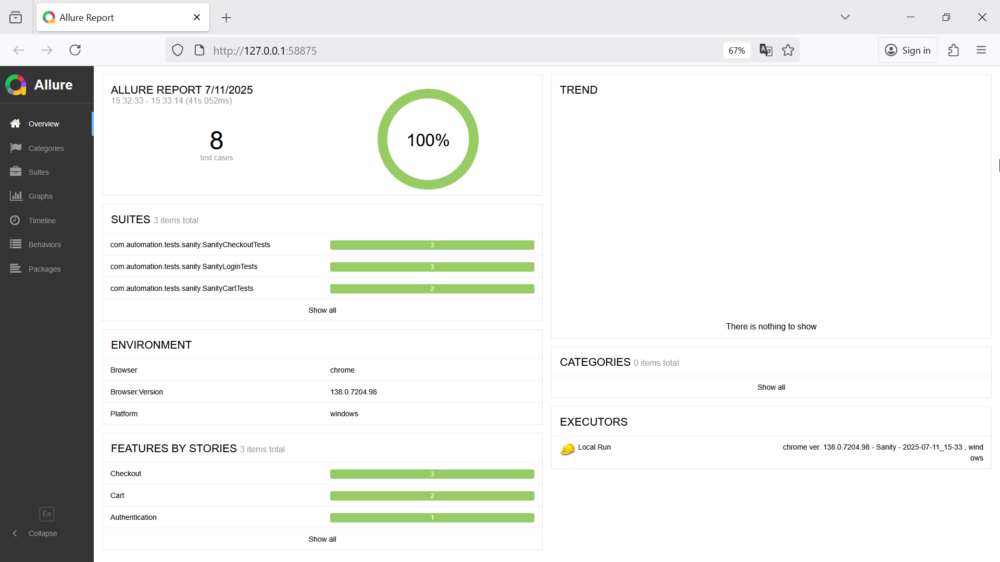

# 🛒 eCommerce UI Automation Testing Project

## 🎯The goal of the repo is to demonstrate the skills with:
- Java-based UI automation testing with support for cross-browser and cross-platform execution
- CI\CD integration from scratch (no frameworks)
- Generating and publishing Allure reports with history
- Running tests by tags and browser combinations

---

## Technologies Used:
- **Java 21**, **Maven**
- **Selenium WebDriver**
- **jUnit5**
- **Allure Reports** with custom executor & environment
- **GitHub Actions**: CI/CD + matrix strategy
- **GitHub Pages**: auto-publish Allure report
- **Browsers**: Chrome, Firefox, Edge, Safari
- **OS**: Windows, Linux, macOS
---

## 🗃️Test Scenarios Covered
- ✅ **Smoke tests**: basic login, logout, product presence
- ✅ **Sanity tests**: cart, checkout flow, navigation
- ✅ **Functional tests**: sorting, product details, calculations
- ✅ **Negative tests**: SQL injection, long inputs, spacing
- ✅ **UI/UX tests**: responsive layout, button states, logo

---
## ▶️ The ways of running tests (remote and local):
### 🌐 1) Remote run via 🚀 CI/CD (GitHub Actions)
#### ✅ Triggered:
1) [Manually](https://github.com/Olexandr29/eCommerce/blob/main/.github/workflows/manually-triggered-run-tests-on-windows.yml) 
on Windows+Chrome 
2) By push:
<br>- [on Linux+Chrome + published Allure report on GitHub Pages](https://github.com/Olexandr29/eCommerce/blob/main/.github/workflows/auto-triggered-by-push-on-linux-chrome-and-publish-allure-report-on-github-pages.yml)
<br>- [on matrix OS & Browsers + published separated Allure reports as artifacts](https://github.com/Olexandr29/eCommerce/blob/main/.github/workflows/auto-triggered-tests-by-push-on-matrix-os-browser.yml)
3) [By schedule](https://github.com/Olexandr29/eCommerce/blob/main/.github/workflows/auto-triggered-tests-by-schedule.yml)
on Windows+Chrome just with tag Smoke

#### 🧩 Matrix Strategy
| OS      | Browsers               |
|---------|------------------------|
| Windows | Chrome, Firefox, Edge  |
| Linux   | Chrome, Firefox        |
| macOS   | Chrome, Firefox, Safari|

#### 📊 Allure Report
[👉 Click to see the Allure report on GitHub Pages](https://olexandr29.github.io/eCommerce/)

### 💻 2) Local run via ⬛>_Terminal (inside IDEA)
#### ✅ Triggered on Windows and:

**Chrome browser** (by default) use the command below:
```
mvn clean test
```
**Other browser** (e.g. Firefox or Edge) use:
```
mvn clean test -Dbrowser=Firefox
```
**Cross-browser**(Chrome, Firefox, Edge) use:
```
mvn clean test -Dbrowser="Chrome Firefox Edge"
```
**Default Chrome browser** and specific **tag** use:
```
mvn clean test -Dgroups=Smoke
```
Specific **Browsers** and **tags** use:
```
mvn clean test -Dgroups="Functional Negative" -Dbrowser="Edge Firefox"
```

#### 🧩 Local run Strategy (Options)
| OS      | Browsers        | Tags                                    |
|---------|-----------------------|-----------------------------------|
| Windows | Chrome, Firefox, Edge | Smoke, Sanity, Functional, Negative, UiUx |

#### 📊 Allure Reports:
#### **Temporary:**

For generating temporary Allure report (on the **temp** folder not related to the project) and without history
after completing the previous command like
```
mvn clean test
```
use:
```
allure serve target/allure-results
```
Look at examples on the screenshots below

[if you want to look at the folder where the report is saved click the link](https://github.com/Olexandr29/eCommerce/blob/main/screenShots/1.1%20report%20generated%20to%20temp%20folder(not%20related%20to%20the%20project).png)
___

#### **Constant with history:**

For generating Allure report (on the **target** folder inside the project) and add testing history (displays after second and more runs)
use this 3 steps:
1) use any command for local run but without the **clear** phase, like:
```
mvn test
```
```
mvn test -Dbrowser=Firefox
```
```
mvn test -Dbrowser="Chrome Firefox Edge"
```
```
mvn test -Dgroups=Smoke
```
```
mvn test -Dgroups="Functional Negative" -Dbrowser="Edge Firefox"
```
or any of you want, but without *clean* phase
2) copy history from the run:
- 2.1) create folder if it deleted
```
New-Item -ItemType Directory -Force -Path "target/allure-results/history"
```
- 2.2) copy history from previous report to the *result* folder for generate a new report
```
Copy-Item -Recurse -Force "target/allure-report/history/*" "target/allure-results/history/" -ErrorAction SilentlyContinue
```
3) generate and open a report:
- 3.1) generate:
```
allure generate target/allure-results --clean -o target/allure-report
```
- 3.2) and open:
```
allure open target/allure-report
```
Look at examples on the screenshots below

[if you want to look at the folder where the report is saved click the link](https://github.com/Olexandr29/eCommerce/blob/main/screenShots/2.1%20report%20generated%20to%20Report%20folder%20insdie%20the%20project(target).png)
___
For cross-browser testing and generating an Allure report with history 
was created the [next script](https://github.com/Olexandr29/eCommerce/blob/main/autorun-by-tags-and-browser-and-generate-allure-report-with-history.ps1)

Just run it and look at the Allure report with history (use the command below):
```
./autorun-by-tags-and-browser-and-generate-allure-report-with-history.ps1
```
Look at examples on the screenshots below

[if you want to look at the folder where the report is saved click the link](https://github.com/Olexandr29/eCommerce/blob/main/screenShots/3.1.%20inside%20the%20project(target)%20folder%20.png)